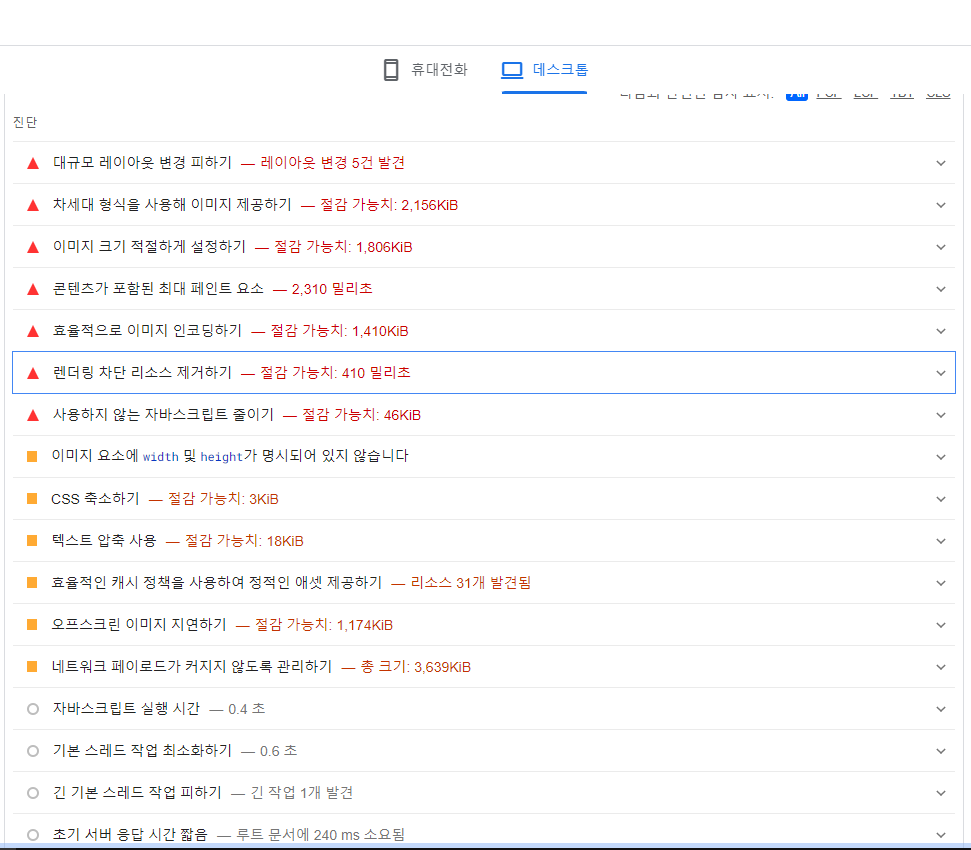
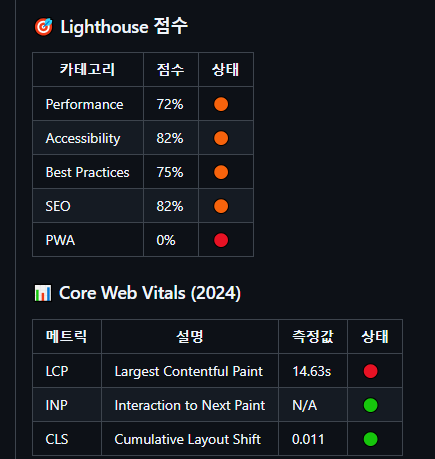
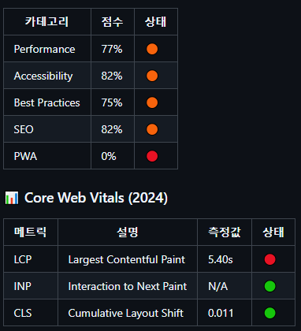
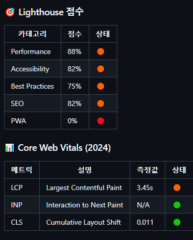
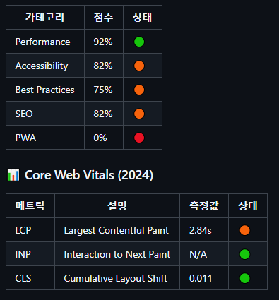
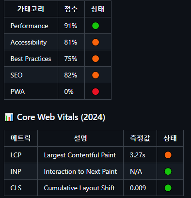
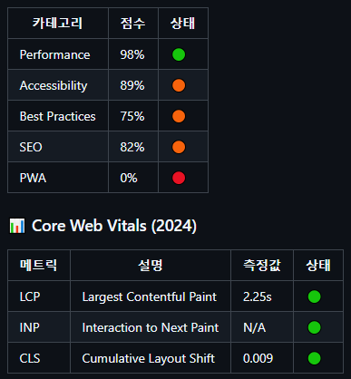
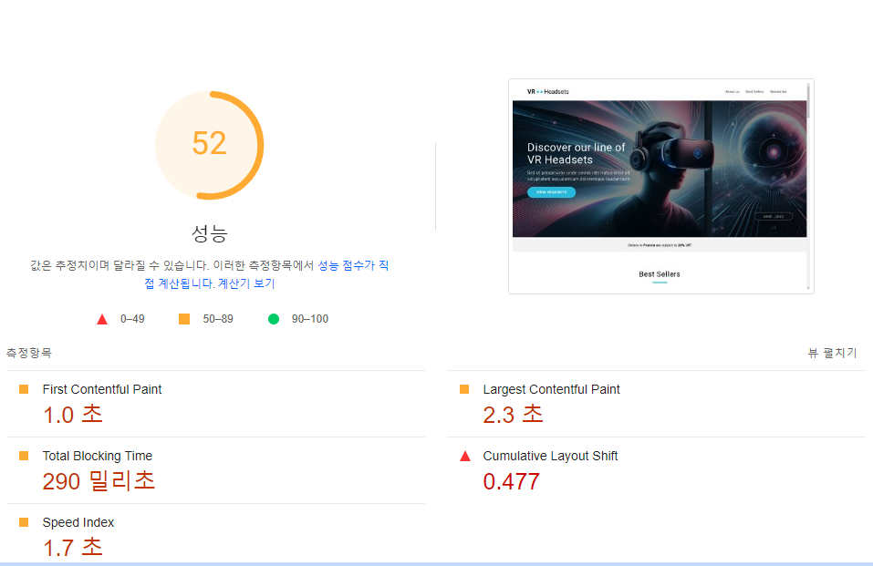
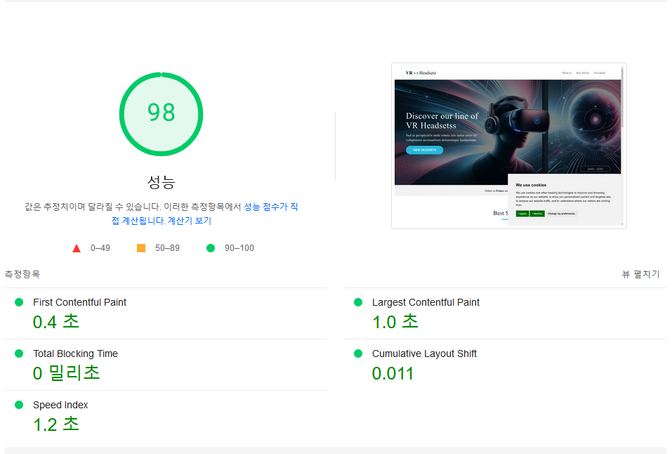

# 바닐라 JS 프로젝트 성능 개선

- url: http://hhplus-last.s3-website-us-east-1.amazonaws.com/

## 성능 개선 보고서

### 목차

1. [성능 향상 체크리스트](#성능-향상-체크리스트)
2. [이미지 포맷 최적화](#이미지-포맷-최적화)
3. [이미지 반응형 최적화 및 크기 설정](#이미지-반응형-최적화-및-크기-설정)
4. [상품 동적로딩 최적화](#상품-동적로딩-최적화)
5. [폰트 최적화](#폰트-최적화)
6. [script태그 defer속성](#script태그-defer속성)
7. [최적화 전후 비교](#최적화-전후-비교)

### 성능 향상 체크리스트

다음 사진은 https://pagespeed.web.dev/ 에서 프로젝트를 분석한 보고서이다. 개선하는데 필요한 목록은 다음과 같다.  

### 이미지 포맷 최적화

- 개선 이유: webp는 jpg, png에 비해 비슷한 품질을 유지하면서 25~35%정도의 더 작은 파일크기를 가지고 있음.

- 개선 방법: 이미지를 jpg, png에서 webp로 포맷하고 압축

- 결과: LCP[^1] 8.8초 감소

[^1]: Largest Contentful Paint.가장 큰 콘텐츠가 렌더링되는 시간으로, 사용자가 페이지가 거의 로드되었다고 느끼는 시점을 반영한다.

| 전                                    | 후                                                    |
| ------------------------------------- | ----------------------------------------------------- |
|  |  |

### 이미지 반응형 최적화 및 크기 설정

- 개선 이유: 클라이언트의 기기에 맞지 않는 이미지(불필요한 리소스) 로딩 중.

- 개선 방법: 기존 반응형코드 `display: none`를 사용한 대신 `picture`태그와 `source`태그, `srcset`속성을 사용하여 기기에 맞는 이미지만 로딩시킴.  이미지에 width, height 명시

- 결과: LCP 약 2초 감소

| 전 | 후 |
| --- | --- |
|  |  |

### 상품 동적로딩 최적화

- 개선 이유: 사용자가 도달하지 않는 곳을 모두 렌더링 시키는 행위는 비효율적

- 개선 방법: `lazy loading`으로 사용자가 특정 위치에 도달할때 관련된 정보가 로딩되도록 최적화

- 결과: LCP 약 0.7초 감소

| 전 | 후 |
| --- | --- |
|  |  |

### 폰트 최적화

- 개선 이유: 웹 폰트를 로딩하면 그 만큼의 네트워크 비용이 필요

- 개선 방법: 정적파일 다운로드 후 업로드

- 결과: LCP 0.4초 증가

| 전 | 후 |
| --- | --- |
|  |  |

### script태그 defer속성

- 개선 이유: html파싱 후 js파싱 과정이 비효율 적.

- 개선 방법: script태그에 defer[^3]를 추가함으로써 html과 js파일의 파싱과정을 최적화

- 결과: LCP 약 1초 감소

[^3]: defer는 html과 js파일을 동시에 파싱하는 것을 의미한다. js파일 실행은 html 파싱이 완료된 후 시작된다.

performance점수도 유의미하게 개선된 모습을 볼 수 있다.

| 전                                                    | 후                                       |
| ----------------------------------------------------- | ---------------------------------------- |
|  |  |

### 최적화 전후 비교

- https://pagespeed.web.dev/ 에서 최적화 전/후를 비교한 표와 사진

| 지표             | 전    | 후    | 개선율 |
| ---------------- | ----- | ----- | ------ |
| FCP[^4]          | 1.0s  | 0.4s  | 60%    |
| LCP              | 2.3s  | 1.0s  | 56.52% |
| TBT[^5]          | 290ms | 0     | 100%   |
| CLS [^6]         | 0.477 | 0.011 | 97.69% |
| Speed Index [^7] | 1.7s  | 1.2s  | 29.41% |

[^4]: FCP (First Contentful Paint). 첫 번째 콘텐츠가 렌더링되기까지 걸리는 시간
[^5]: TBT (Total Blocking Time). 페이지 로딩 중 차단된 시간의 합
[^6]: CLS (Cumulative Layout Shift). 레이아웃 불안정성을 측정한 값
[^7]: Speed Index. 페이지 로딩의 시각적 완성도를 나타내는 지표

최적화 전    최적화 후 
