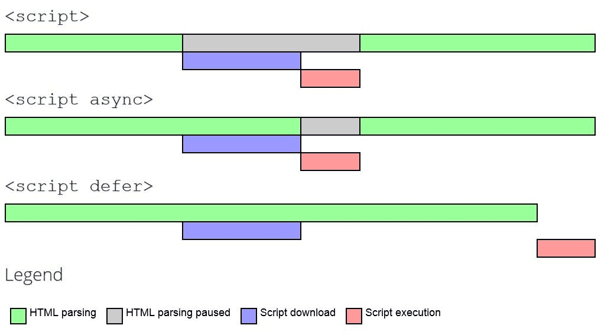

# 바닐라 JS 프로젝트 성능 개선

- url: http://hhplus-last.s3-website-us-east-1.amazonaws.com/

## 성능 개선 보고서

### 목차

1. [성능 향상 체크리스트](#성능-향상-체크리스트)
2. [이미지 포맷 최적화](#이미지-포맷-최적화)
3. [이미지 반응형 최적화 및 크기 설정](#이미지-반응형-최적화-및-크기-설정)
4. [상품 동적로딩 최적화](#상품-동적로딩-최적화)
5. [폰트 최적화](#폰트-최적화)
6. [script태그 defer속성](#script태그-defer속성)
7. [최적화 전후 비교](#최적화-전후-비교)

### 성능 향상 체크리스트

다음 사진은 https://pagespeed.web.dev/ 에서 프로젝트를 분석한 보고서이다. 개선하는데 필요한 목록은 다음과 같다.  

### 이미지 포맷 최적화

이미지를 jpg, png에서 webp로 포맷하고 압축한 작업이 가장 큰 성능 개선 효과를 볼 수 있었다.   LCP[^1]를 무려 8.8초나 줄여줬다.

[^1]: Largest Contentful Paint.가장 큰 콘텐츠가 렌더링되는 시간으로, 사용자가 페이지가 거의 로드되었다고 느끼는 시점을 반영한다.

| 전                                    | 후                                                    |
| ------------------------------------- | ----------------------------------------------------- |
|  |  |

### 이미지 반응형 최적화 및 크기 설정

클라이언트의 기기에 맞는 이미지를 표시하는데 기존코드는 `display: none`를 사용했다.  하지만 이 방식은 모든 이미지를 로딩 해야하므로 `picture`태그와 `source`태그, `srcset`속성을 사용하여 기기에 맞는 이미지만 로딩하도록 최적화했다.  그리고 이미지에 width, height를 추가해줬다.  그 결과로 유의미한 성능개선 효과를 볼 수 있었다.

| 전 | 후 |
| --- | --- |
|  |  |

### 상품 동적로딩 최적화

사용자가 도달하지 않는 곳을 모두 렌더링 시키는 행위는 비효율적이다.  `lazy loading`으로 사용자가 특정 위치에 도달할때 관련된 정보가 로딩되도록 최적화해줬다.  크지않지만 근소하게 성능이 개선되었다.

| 전 | 후 |
| --- | --- |
|  |  |

### 폰트 최적화

웹폰트를 로딩하면 그 만큼의 네트워크 비용이 또 필요하다. 그래서 정적파일로 받아올 수 있게 폰트도 최적화 작업을 진행했다.  하지만 lcp수치가 미묘하게 감소하였다[^2]

[^2]: font-display: swap을 사용했는데도 불구하고 lcp수치가 감소한 이유를 찾지 못했다. 원인을 찾으면 다시 기술 예정

| 전 | 후 |
| --- | --- |
|  |  |

### script태그 defer속성

script태그에 defer[^3]를 추가함으로써 html과 js파일의 파싱과정을 최적화했다.

[^3]: defer는 html과 js파일을 동시에 파싱하는 것을 의미한다. js파일 실행은 html 파싱이 완료된 후 시작된다. 그림참조 

performance점수도 유의미하게 개선된 모습을 볼 수 있다.

| 전                                                    | 후                                       |
| ----------------------------------------------------- | ---------------------------------------- |
|  |  |

### 최적화 전후 비교

우리는 이미지, 폰트, 지연 로딩등 간단한 몇 가지만을 추가해줬음에도 확실히 개선된 성능을 확인했다.  그만큼 코드레벨에서의 최적화도 중요함을 알 수 있다.

최적화 전    최적화 후 
